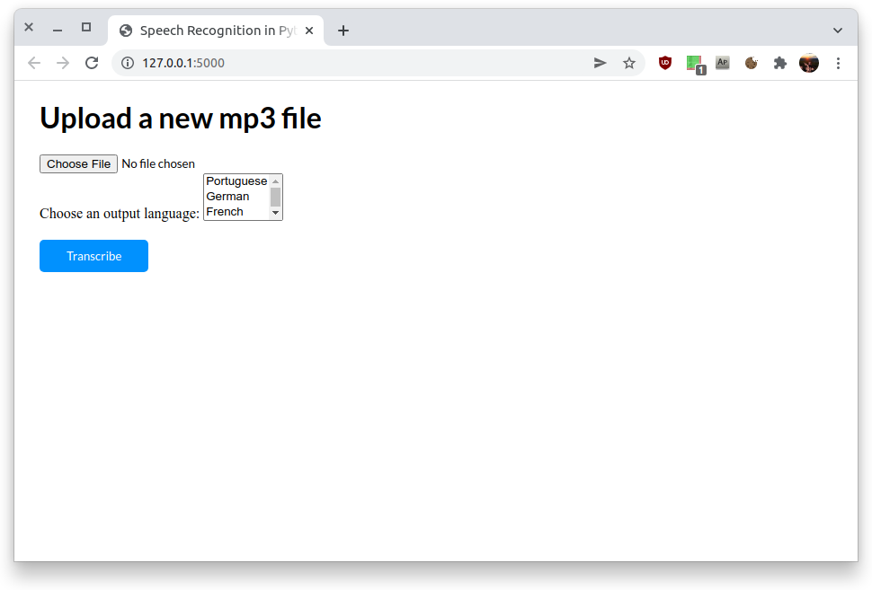
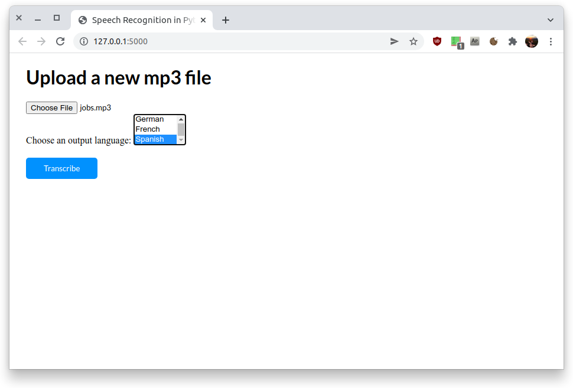
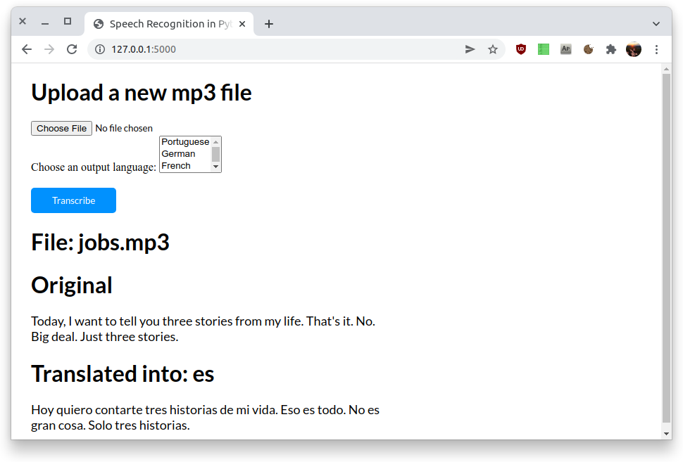

# Voice  Translator. 

This project is a simple tool, that does voice recognition, translates it in a language to choose and prints the translated output. 

### Overview

```bash
.
├── app.py
├── hearandlisten-da50cb4c59a8.json
├── backend
│   ├── __init__.py
│   ├── jobs.mp3
│   ├── main.py
│   ├── play_sound.py
│   ├── speech2text.py
│   ├── text2speech.py
│   ├── translate.py
├── README.md
├── requirements.txt
├── static
│   └── styles
│       └── index.css
├── templates
    └── index.html
```


### Backend

* Python
* Google Cloud API
  * Cloud Speech-to-Text API ```from google.cloud import speech```
  * Cloud Translation API ```from google.cloud import translate_v2 as translate```
  * Cloud Text-to-Speech API ```from google.cloud import texttospeech```
* Flask

### Frontend

* very basic HTML & CSS

### Screenshots

**Step 1: Load page**



**Step 2: Choose file and language**



**Step 3: Get the results**



## Installed packages: 
```python
pip install flask
pip install google-cloud-speech
pip install google-cloud-translate
pip install google-cloud-texttospeech
pip install SpeechRecognition
```

See also the [requirements file](./requirements.txt).

# Setup of the Google Cloud Platform

https://console.cloud.google.com/ &rarr; register

## create new project

* new project &rarr; enter project name
* create credentials
  * speech2text api
  * create keys &rarr; keys &rarr; add key &rarr; JSON &rarr; download and store it secure

## add needed API's

* Cloud Speech-to-Text API ```from google.cloud import speech```
* Cloud Translation API ```from google.cloud import translate_v2 as translate```
* Cloud Text-to-Speech API ```from google.cloud import texttospeech```
